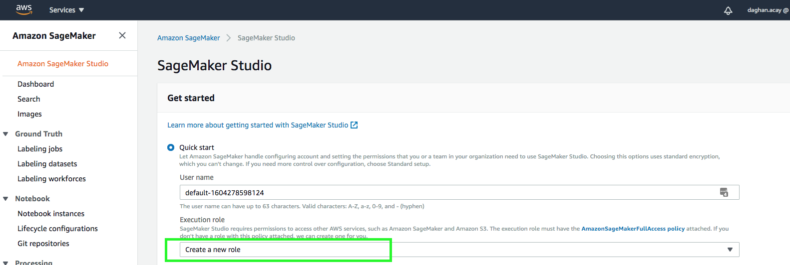
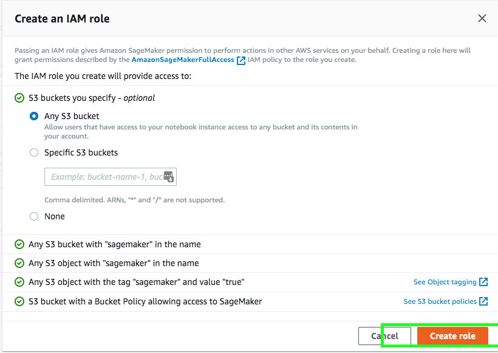
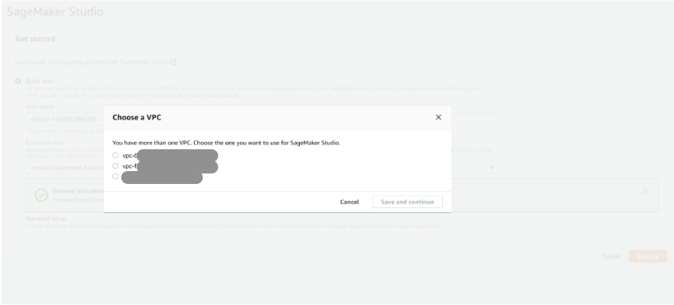
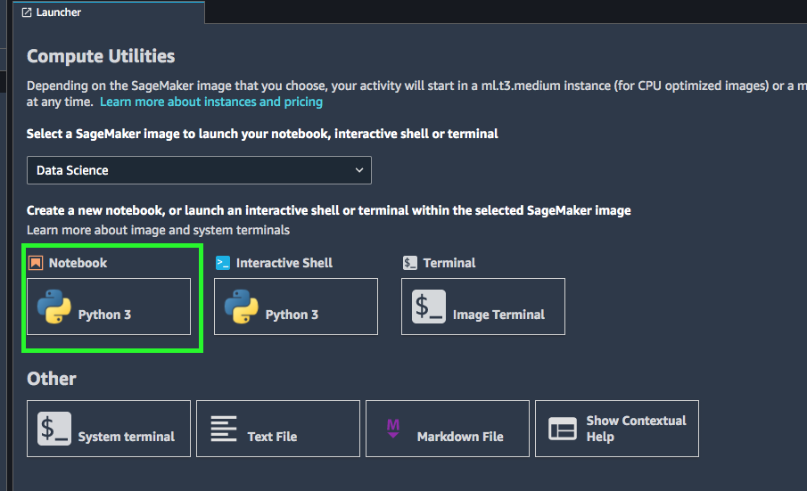
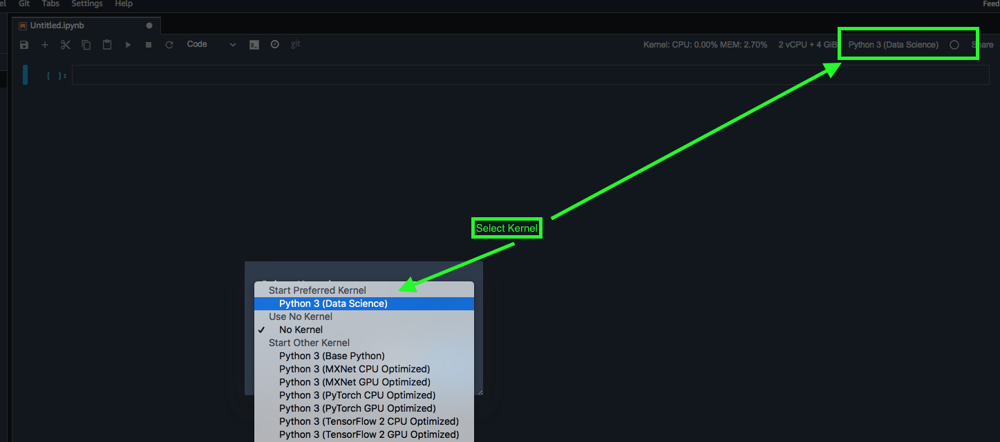

# Setting up for the workshop

## Set up Sagemaker Studio

Open your AWS console and log into Sagemaker you can search for Sagemaker on the console. Once you are in Sagemaker and click on the "Amazon Sagemaker Studio" on the left top of the console.  We will need to be in one of the supported regions for SageMaker Studio so ensure your region is one of :  US East (Ohio), US East (N. Virginia), US West (Oregon), or Europe (Ireland) at the time of this commit.  For best latency we should select:  US West (Oregon) ( look to the top right of the screen to the left of "Support" for the drop down to change regions.)

Select quick start and select execution role "Create New Role" In the opening screen accept the defaults and click on "Create Role"

**Note**! take a copy of the role created since we will need it during clean up mine looks like "AmazonSageMaker-ExecutionRole-20201102T121769" 

After the role is created click the "Submit" button. This should start creating a Sagemaker Studio for you. In couple of minutes it will be ready, click on the "Open Studio" button and continue with the next step. This will take some time. We need to mention that this wait is only for the first time creating the studio. It will be much faster in the consecutive runs of Sagemaker Studio. 

**Note** If oyu are using multiple VPC's You may be asked to choose one. Please select one that you want to run your Sagemaker studio in.

While you are waiting for it to be ready here are some benefits of [Sagemaker studio over Sagemaker notebook instances](https://docs.aws.amazon.com/sagemaker/latest/dg/notebooks-comparison.html):

- Starting a Studio notebook is faster than launching an instance-based notebook. Typically, it is 5-10 times faster than instance-based notebooks.
- Notebook sharing is an integrated feature in SageMaker Studio. Users can generate a shareable link that reproduces the notebook code and also the SageMaker image required to execute it, in just a few clicks.
- SageMaker Studio notebooks come pre-installed with the latest Amazon SageMaker Python SDK.
- SageMaker Studio notebooks are accessed from within Studio. This enables you to build, train, debug, track, and monitor your models without leaving Studio.
- Each member of a Studio team gets their own home directory to store their notebooks and other files. The directory is automatically mounted onto all instances and kernels as they're started, so their notebooks and other files are always available. The home directories are stored in Amazon Elastic File System (Amazon EFS) so that you can access them from other services.
- When using AWS SSO, you use your SSO credentials through a unique URL to directly access SageMaker Studio. You don't have to interact with the AWS Management Console to run your notebooks.
- Studio notebooks are equipped with a set of predefined SageMaker image settings to get you started faster. 

On top of that Sagmaker studio comes with SageMaker Autopilot supports:

- Input data in tabular format, with automatic data cleaning and preprocessing,
- Automatic algorithm selection for linear regression, binary classification, and multi-class classification,
- Automatic hyperparameter optimization,
- Distributed training,
- Automatic instance and cluster size selection.

Now that your Sagemaker is set up lets see some of the properties

You can see your user and you can share your work with other users. You can also add different images to your Sagemaker studio. A SageMaker image is a container that is compatible with SageMaker Studio. An image is stored in an Amazon Elastic Container Registry (ECR) repository. An image containes algorithms or resources you want to use such as Julia, R, Scala, Tensorflow 2 [with Sagamaker Studio](https://docs.aws.amazon.com/sagemaker/latest/dg/studio-byoi.html). Although it is very powerful this topic is outside the scope of this workshop. 

## Setting up the Sagemaker Kernel

Once the Sagemaker Studio is active click on the Python3 as shown in the image 

This will create a Python3 environment that you can use for your Jupyter notebook. After the environment is created you need to select the kernel as shown below.

## Next step

Please continue to the [next step](../Step2-RunAutoML/README.md) where we train a model to predict cutomer behavior on a fictitious data
