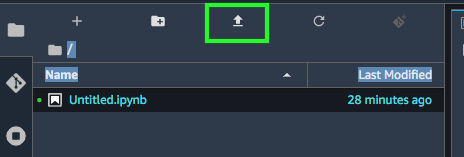
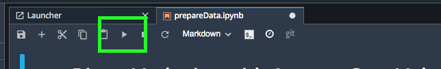

# Section 2 -- Run Automl to Predict a focus group for a specific Banking product

Direct marketing, through mail, email, phone, etc., is a common tactic to acquire customers.  Because resources and a customer's attention are limited, the goal is to only target the subset of prospects who are likely to engage with a specific offer.  Predicting those potential customers based on readily available information like demographics, past interactions, and environmental factors is a common machine learning problem. You can imagine that this task would readily translate to marketing lead prioritisation in your own organisation.

A typical introductory task in machine learning (the "Hello World" equivalent) is one that uses a dataset to predict whether a customer will enrol for a term deposit at a bank, after one or more phone calls. We will be using the dataset given at [Bank Marketing Data Set](https://archive.ics.uci.edu/ml/datasets/bank+marketing). At the end of this step of the workshop you will have a model that can predict if a new customer will enrol to a term deposit offering. Lets start downloading the data to our sagemaker environment.

The rest of this workshop is documented in the Sagemaker notebooks. It is organized that way since Sagemaker studio is a good way of document and running the process in one single location. Please upload the sagemaker notebooks as described in the next section and follow the instructions in the sagemaker studio. 

## Set up data

Please upload the Step2-RunAutoML/src/prepareData.ipynb to Jupyter notebook as shown in the image 

Continue the instruction in the Jupyter notebook. Please select "Python Data Science" kernel if it is asked. In order to run the notebook select the cell and click on the Play button on top of the notebook. 

## Prepare and run the AutoML model

Now we are ready to create AutoML model. Please upload the Step2-RunAutoML/src/createModelandRunInference.ipynb to Jupyter notebook as above. Continue the instruction in the Jupyter notebook. Please select "Python Data Science" kernel if it is asked.

We are now ready for [step 3](Step3-RunExistingMode/README.md)