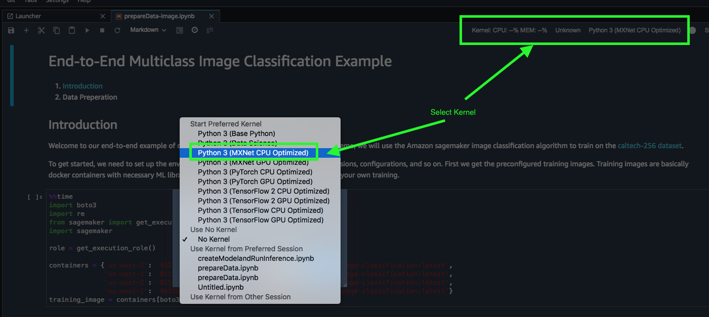

# Section 3 -- Run Existing Model -- Image processing

In this section, you’ll work your way through a Jupyter notebook that demonstrates how to use a built-in algorithm in SageMaker. More specifically, you’ll use SageMaker’s image classification algorithm, a supervised learning algorithm that takes an image as input and classifies it into one of 256 classes. In this case we will try to classify an image on the web and see if it is a "bathtub". You can try different web images and try to see if the algorithm can classify them as one of the trained classes. 

The algorithm we will use in this section is a convolutional neural network (CNN) and one of its implementation by MxNet library (ResNet) that can be trained from scratch, or trained using transfer learning when a large number of training images are not available. In this section you’ll train the image classification algorithm from scratch on the Caltech-256 dataset.

## Set up the data

- Upload Step3-RunExistingModel/src/prepareData-image.ipynb to your Sagemaker Studio notebook
- This time select "MXnet CPU optimized" kernel

- Follow the instructions in the Jupyter notebook

## Running Training and Inference

- Upload Step3-RunExistingModel/src/createModelandRunInference-image.ipynb to your Sagemaker Studio notebook
- Select "MXnet CPU optimized" kernel again
- Follow the instructions in the Jupyter notebook

You have completed the Workshop!!!! (fireworks, smileys and all other celebratory emojis) 

Please continue to [clean up section](../CleanUp/README.md) before you leave the workshop. Resources we use today will cost you ~AUD 15 per day unless you delete them. 
